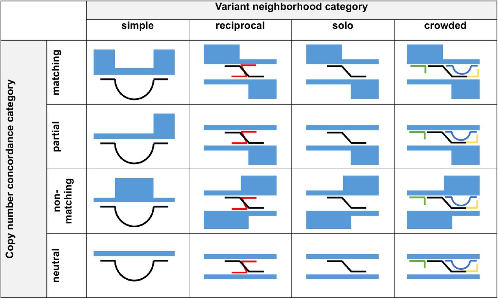

# Ribbon/SplitThreader

Ribbon and SplitThreader are both visualization tools for exploring complex rearrangements and long-range structural variants. Especially if you have long reads, Ribbon and SplitThreader should be quite helpful for figuring out what's going on around large variants.

Ribbon is available online at [genomeribbon.com](https://genomeribbon.com)

## Major changes in 2024

[v2.0 release notes](docs/release_notes_v2.md)


Both built by Maria Nattestad originally, we decided in 2024 to put Ribbon and SplitThreader together and give them both major updates. This was prompted by a collaboration with the Genome in a Bottle (GIAB) team at NIST to support the release of their somatic (tumor) benchmark dataset for HG008. 2024 development done by Maria Nattestad and Robert Aboukhalil.

## Documentation

* How to read the visualizations? Check out [interpretation](docs/interpretation.md) for examples.
* What changed in 2024? Including how to make a session with multiple files: [v2.0 release notes](docs/release_notes_v2.md)

## Citation and publications

Please cite our paper in [_Bioinformatics_](https://doi.org/10.1093/bioinformatics/btaa680).

The BioRxiv has both the [Ribbon preprint](https://www.biorxiv.org/content/10.1101/082123v1) and the [SplitThreader preprint](https://www.biorxiv.org/content/10.1101/087981v1.full).

### Ribbon


### SplitThreader


There are several algorithms available within SplitThreader that can help make sense of long-range rearrangements, from categorizing variants:

to searching for gene fusions:
[gene fusion algorithms described in supplement to SplitThreader preprint](https://www.biorxiv.org/content/biorxiv/suppl/2016/11/15/087981.DC1/087981-1.pdf).

## Local deployment

If you need to run Ribbon/SplitThreader without internet access, go to releases and find the ribbon_splitthreader.zip bundle from the latest release.

```bash
unzip ribbon_splitthreader.zip
cd ribbon_splitthreader
python3 -m http.server
# or run any other server pointed at that directory.
```

Note that permalinks won't work without internet access.

## Development and building from source

To develop new features in Ribbon, first install [npm](https://www.npmjs.com/get-npm).

Then clone this repository and build it:

```bash
# Clone repo and install dependencies
git clone https://github.com/marianattestad/ribbon
cd ribbon
npm install
# to run locally for development
npm run dev

# to build from source:
npm run build
npm run serve # to test the build
# To run a server with this build:
cd dist
python3 -m http.server
```
