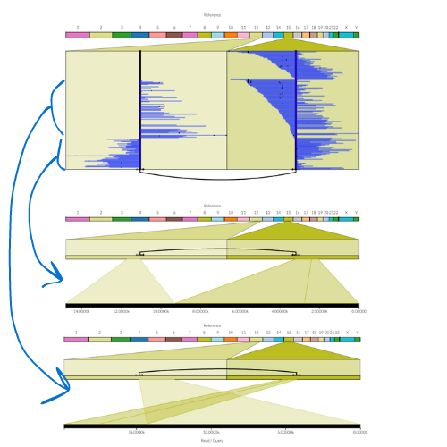

# Interpreting SplitThreader plots

Here we show some examples of patterns you might see in SplitThreader and how we would interpret them.

## SplitThreader basics

The most important pattern to build your intuition in SplitThreader is that the feet of the variant are expected to be on the same side as the higher copy number -- at least for events that do affect the copy number.

Some examples:

## Simple deletion

## Simple tandem duplication

## Reciprocal

Notice that right on top of the black highlighted variant is a yellow line. If you look closely, you can see that the yellow feet stick out in the opposite direction from the black variant on both sides.
These are two variant calls but clearly come from the same event. Basically two sequences are cut and swap partners. That is why there is no coverage change. We see these reciprocal events often in SKBR3 too (the cell line I was studying when I built Ribbon and SplitThreader).

This reciprocal event looks like this in Ribbon:

## Problematic

This has no coverage change, but unlike the reciprocal event above, this has no other variants nearby to cancel it out.

It could be just very few reads that show this event, so the next step is to look for whether any reads in Ribbon actually support this event.

## Also problematic

I would be suspicious of this one. This has partial support near one breakpoint, but that copy number change is several coverage bars away from the variant (each bar is a 10kb bin here), not to mention that the other side shows no coverage change at all. That copy number change on top may be better explained by some other variant that we are not seeing here.

# Interpreting Ribbon visualizations

This is a simple translocation in a cancer sample. There are two bams, the top is the normal sample and bottom is the tumor sample. We see the translocation in a subset of the tumor reads only.

First, note that settings refer to multi-read and single-read views, which are here:

Clicking a read in the multi-read view shows it in the single-read view below.

It's important to know that in the multi-read view, the alignments will be next to each other if they are from the same read.

## Inverted duplication

I've observed before that inverted duplications don't take place at a single breakpoint but instead a small piece of the sequence (279 bp in this case) is left out of the duplication.

In SplitThreader you can even see it when you zoom in enough:

But in Ribbon you can see the details:

Same read shown as a dotplot:

## Another compound event

A small sequence is inverted right in the middle of the breakpoint of a larger translocation.

